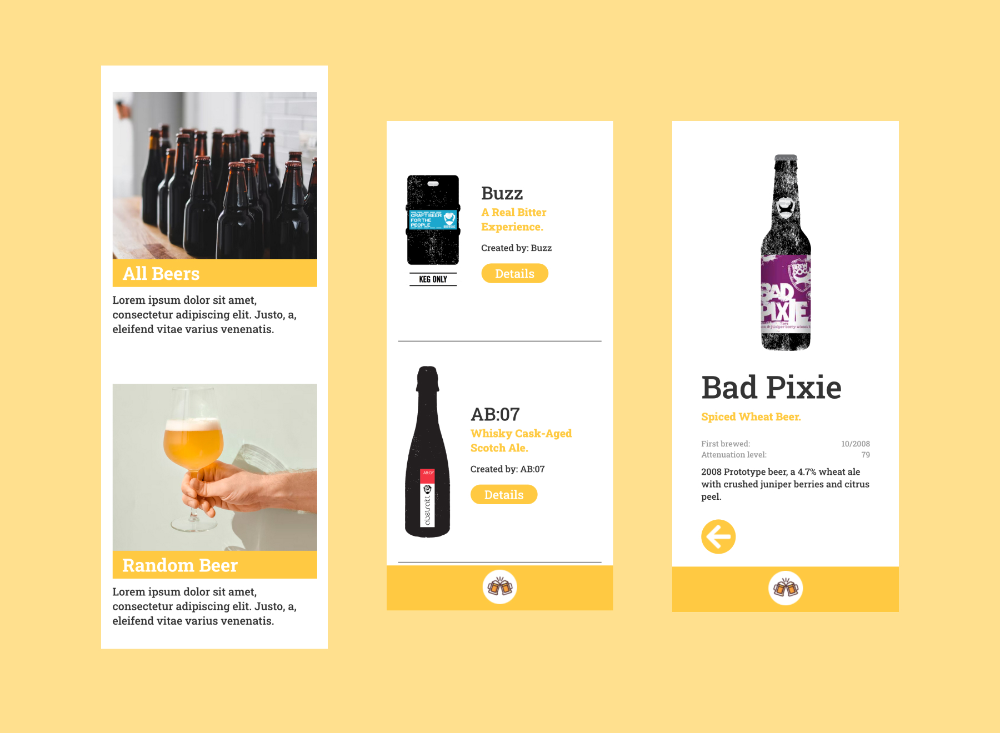

# beer-api-react | Beer App using Beers Api

In this challenge I created a beer app using Beers Api from https://github.com/ironhack-labs/lab-react-ironbeers. This project is build with React and uses Router DOM Package.

## Table of contents

- [Overview](#overview)
  - [The challenge](#the-challenge)
  - [Screenshot](#screenshot)
  - [Links](#links)
- [My process](#my-process)
  - [Built with](#built-with)
- [Author](#author)
- [Acknowledgments](#acknowledgments)

## Overview

### The challenge

The task is to create a beer app using an API.

- Use this API https://github.com/ironhack-labs/lab-react-ironbeers
- Create the basic structure of your homepage
  - All beers
  - Random beer
- Create a navbar. The navbar is always shown when you are not on the home page and leads back to the start page
- List the beers. It should contain:
  - picture
  - Surname
  - slogan
  - Producer (contributed_by)
  - create an additional link that leads to the detail page of the beer! The link should lead to /beers/:beerId
- Create the beer detail view:
  - the picture
  - the name
  - the slogan
  - when it was brewed for the first time (first_brewed)
  - the attenuation_level
  - the description
  - the producer (contributed_by)
- Create the “random beer” page. Use the random endpoint of the [API](https://ih-beers-api2.herokuapp.com/beers/random). The structure of the page is like the detailed view

### Screenshots

### Links

- Solution URL: [https://github.com/jenniferhubermayer/beer-api-react](https://github.com/jenniferhubermayer/beer-api-react)
- Live Site URL: [https://shiny-brioche-5134f8.netlify.app/](https://shiny-brioche-5134f8.netlify.app/)

## My process

### Built with

- React App (using [React Router DOM Package](https://v5.reactrouter.com/))
- Semantic HTML5 markup
- CSS (mobile only)
- Flexbox
- JavaScript

## Author

- Website - [https://github.com/jenniferhubermayer](https://github.com/jenniferhubermayer)

## Acknowledgments

This project has been realized as part of the [super(c)ode](https://www.super-code.de/) "Front-End Boot-Camp 2022".
